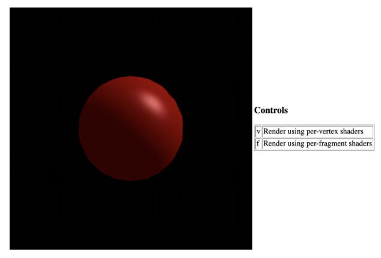

# Computer-Graphics-Illumination-and-Shading
CSCI-610

# Introduction:-

The goal of this assignment is to introduce you to shading in WebGL. The assignment will focus on the Phong Illumination Model and implemented using per-vertex (Gouraud) shading and per-fragment (Phong) shading.
Rather than having you write the GLSL shader for Phong (which is freely available on the Internet, including the site of last week's online activity) yourself, the assignment will focus on parameter passing from javascript to a set of pre-distributed shaders. 
When completed, your assignment should display a sphere shaded using the Phong Illumination model. The application will also allow for switching between per-vertex and per-fragment shading.
It will looks similar to the image below (though your image may vary based on the Phong parameters that you chose)

# What you need to do:-

You will complete functions in the javascript code (most from scratch) that provides the proper parameters to the GLSL shaders. Some of these functions have existed (in some form) in previous assignments and you should feel free to consult the code provided in these previous assignments as guidance. Also, a reference for WebGL javascript calls (made available by Mozilla) can be found here

* In the file shadeMa in. js, complete the following functions. Be sure to read the comments in the code for guidance:
* bindVAO (shape, program) - Creates, binds, and fills a VAO for a shape that makes use of a given program.
* setUpPhong (program) - Sets all of the uniform variables for the Phong shaders found in program. Choice of parameter values are up to you, but be sure that the values that you choose results in a clear illustration of the Phong illumination model with a clear and discernible specular highlight.
* setUpCamera (program) - Sets up the uniform setting for the transform that sets up you camera and projection. Feel free to base your code on what what supplied for Assignment 6 - 3D Transformations.
* You should not have to change any code below the line that reads "// No need to edit below this line"
